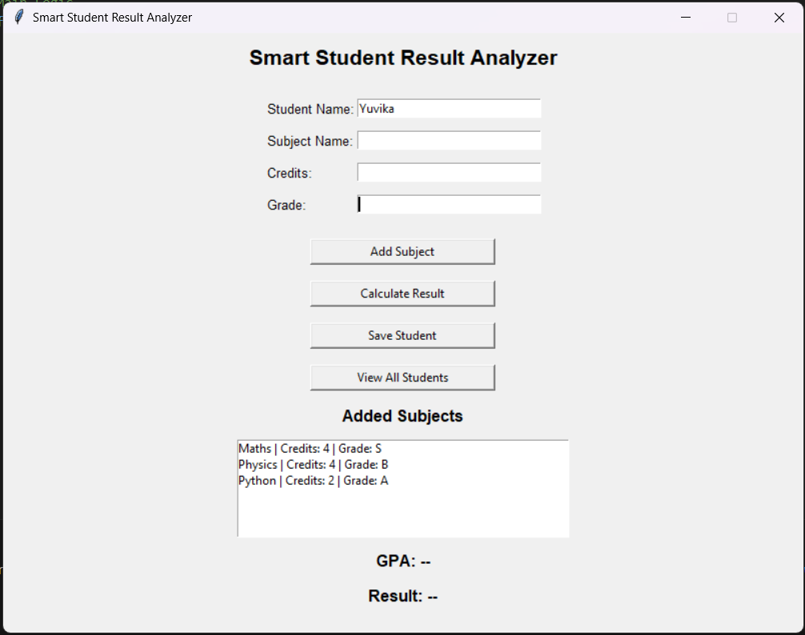
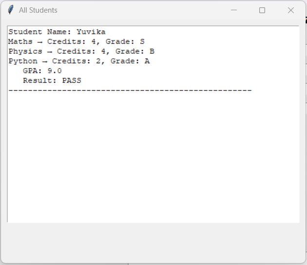

# Smart Student Result Analyzer (Python GUI)

A beginner-friendly **Python GUI application** built using **Tkinter** to calculate student GPA, determine PASS/FAIL status, and manage **multiple students**. 


## Demo





## Features

*  GPA calculation based on credits and grades
*  PASS/FAIL logic
  * **FAIL** if any subject has grade `F`
*  Supports **multiple students**
*  Visual list of added subjects
*  Clean **GUI (Tkinter)**
*  Input validation for credits and grades


##  Grading System

| Grade | Points |
| ----- | ------ |
| S     | 10     |
| A     | 9      |
| B     | 8      |
| C     | 7      |
| D     | 6      |
| E     | 5      |
| F     | 0      |


##  Application Flow

1. Enter **Student Name**
2. Enter **Subject Name**, **Credits**, and **Grade**
3. Click **Add Subject** (repeat for all subjects)
4. Click **Calculate Result**
5. Click **Save Student**
6. Use **View All Students** to see saved records


##  Core Python concepts

* Dictionaries
* Functions
* Loops
* Input validation
* Event-driven programming


## Why this project?
This project was created to practice GUI development, logic building, and data validation while solving a real academic use case.


## 📌 Sample Output

```
Student Name: Yuvika
maths → Credits: 4, Grade: A
physics → Credits: 3, Grade: B
GPA: 8.57
Result: PASS
```


## Run

```bash
python main.py
```
